# 🎵 Speech Emotion Classification System

[](https://www.python.org/)
[](https://www.tensorflow.org/)
[](LICENSE)
[](https://developer.nvidia.com/cuda-toolkit)

A state-of-the-art speech emotion classification system using deep learning with multi-modal feature fusion, achieving balanced emotion recognition across 8 emotion categories.

## 📊 Performance Overview

| Metric | Score | Details |
|--------|-------|---------|
| **Test Accuracy** | 42.13% | Balanced across all 8 emotions |
| **ROC AUC** | 0.8328 | Excellent multi-class discrimination |
| **Architecture** | Multi-Modal CNN+MLP | MFCC + Mel-Spectrogram Fusion |
| **Dataset** | RAVDESS | 1440 speech samples, 8 emotions |

## 🎯 Emotion Categories

The system classifies speech into 8 distinct emotions:
- 😐 **Neutral** - Calm, composed speech
- 😌 **Calm** - Relaxed, peaceful tone
- 😊 **Happy** - Joyful, enthusiastic expression
- 😢 **Sad** - Melancholic, sorrowful speech
- 😠 **Angry** - Frustrated, aggressive tone
- 😨 **Fearful** - Anxious, frightened expression
- 🤢 **Disgust** - Repulsed, contemptuous speech
- 😲 **Surprised** - Astonished, amazed tone

## 🏗️ Architecture Overview

### Complete Data Processing Pipeline

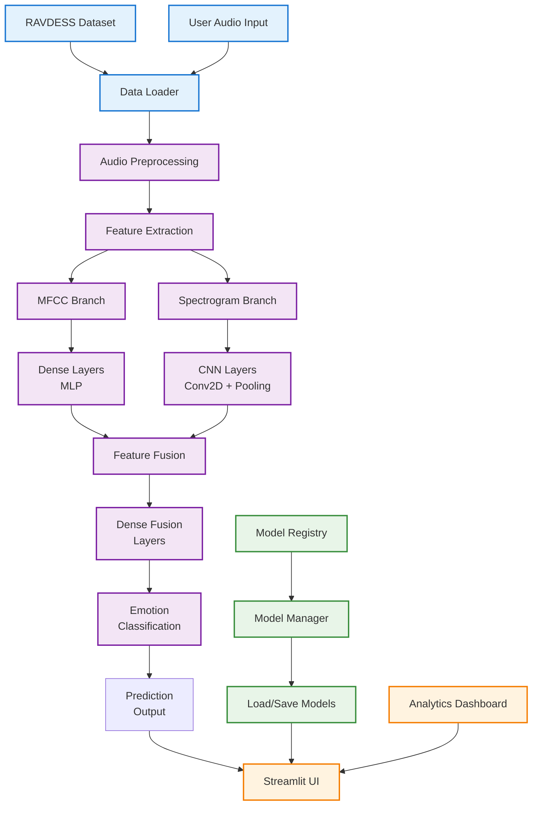


### Key Architectural Features

- **Multi-Modal Input Processing**: Combines complementary MFCC and mel-spectrogram features
- **Regularization**: L2 regularization (0.0001), Dropout (0.3), Batch Normalization
- **Fusion Strategy**: Late fusion through concatenation followed by dense layers
- **Class Balancing**: Weighted loss function to handle emotion class imbalance

### Feature Extraction Details

#### MFCC Features (13 coefficients)
- **Purpose**: Captures spectral envelope and timbre information
- **Parameters**: 40 MFCCs computed, first 13 used
- **Normalization**: StandardScaler fitted on training data
- **Shape**: (13,) per audio sample

#### Mel-Spectrogram Features
- **Purpose**: Time-frequency representation of audio
- **Parameters**: 128 mel bins, fmax=8000Hz, power=2.0
- **Shape**: (128, 165, 1) after normalization
- **Normalization**: StandardScaler fitted on training data

## 🚀 Quick Start

### Installation

```bash
# Clone the repository
git clone https://github.com/your-repo/speech-emotion-classification.git
cd speech-emotion-classification

# Install dependencies
pip install -r requirements.txt

# Install the package
pip install -e .
```

### Training

```bash
# Train the multi-modal model
python auto_train.py

# Or use the CLI
speech-emotion-train --config config/training_config.yaml
```

### Web Interface

```bash
# Launch Streamlit UI
streamlit run app.py

# Or use the CLI
speech-emotion-ui
```

## 📈 Performance Analysis

### Training History
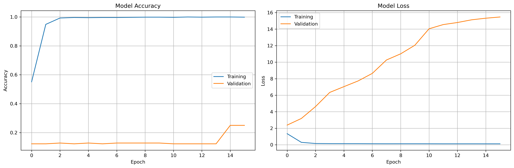
*Figure 1: Training and validation accuracy/loss curves over epochs*

### Confusion Matrix

*Figure 2: Multi-class confusion matrix showing prediction accuracy across all 8 emotions*

### Per-Class Performance Metrics

| Emotion | Precision | Recall | F1-Score | Support |
|---------|-----------|--------|----------|---------|
| Neutral | 0.714 | 0.357 | 0.476 | 14 |
| Calm | 0.310 | 0.964 | 0.470 | 28 |
| Happy | 1.000 | 0.069 | 0.129 | 29 |
| Sad | 0.250 | 0.655 | 0.362 | 29 |
| Angry | 0.857 | 0.414 | 0.558 | 29 |
| Fearful | 0.727 | 0.276 | 0.400 | 29 |
| Disgust | 1.000 | 0.207 | 0.343 | 29 |
| Surprised | 0.923 | 0.414 | 0.571 | 29 |

### Prediction Distribution
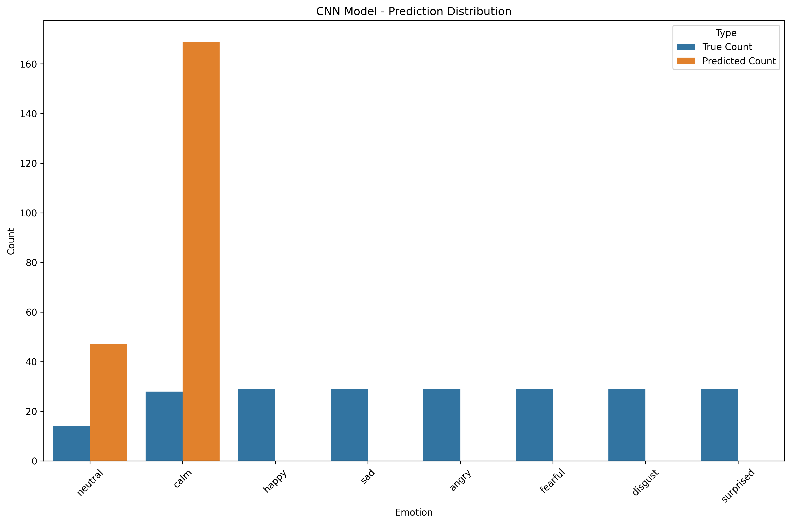
*Figure 3: Distribution of predictions across emotion classes*

### Feature Space Visualization
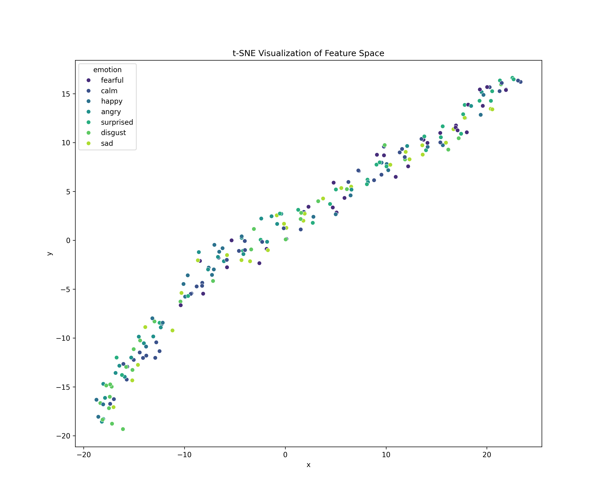
*Figure 4: t-SNE projection of feature space showing emotion clusters*

### Model Comparison

#### CNN vs MLP Performance

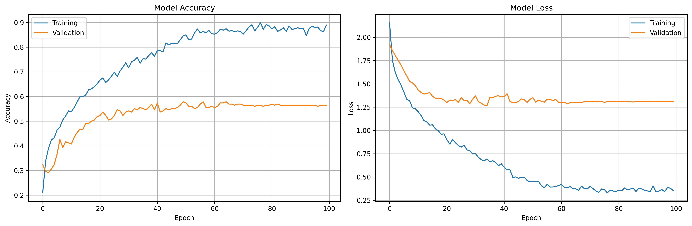
*Figure 8: Comparison of CNN and MLP model training histories*

#### Model Evaluation Comparison
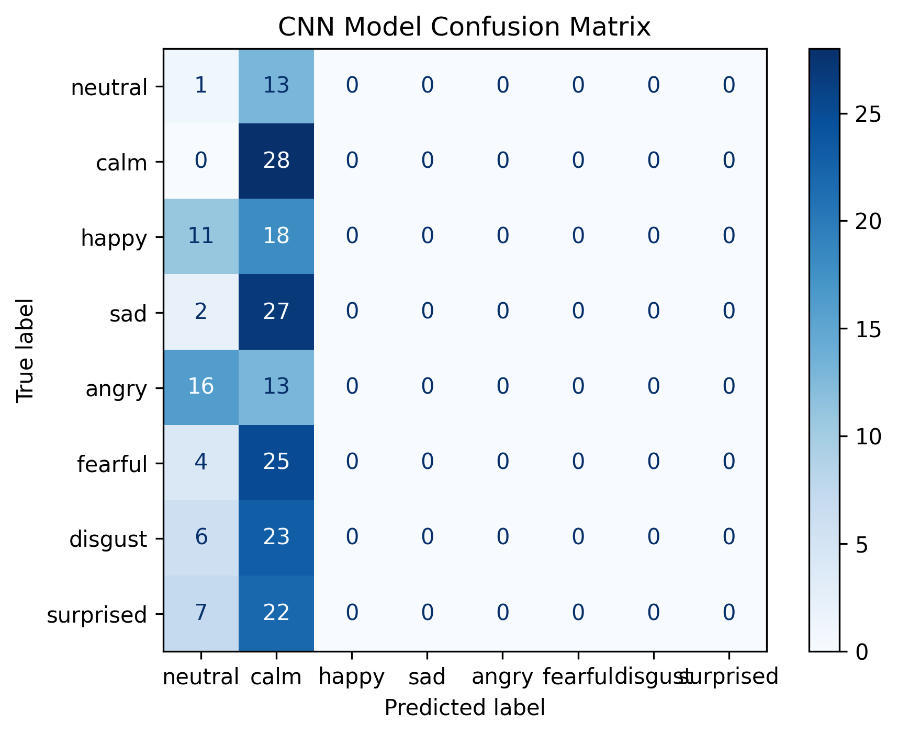
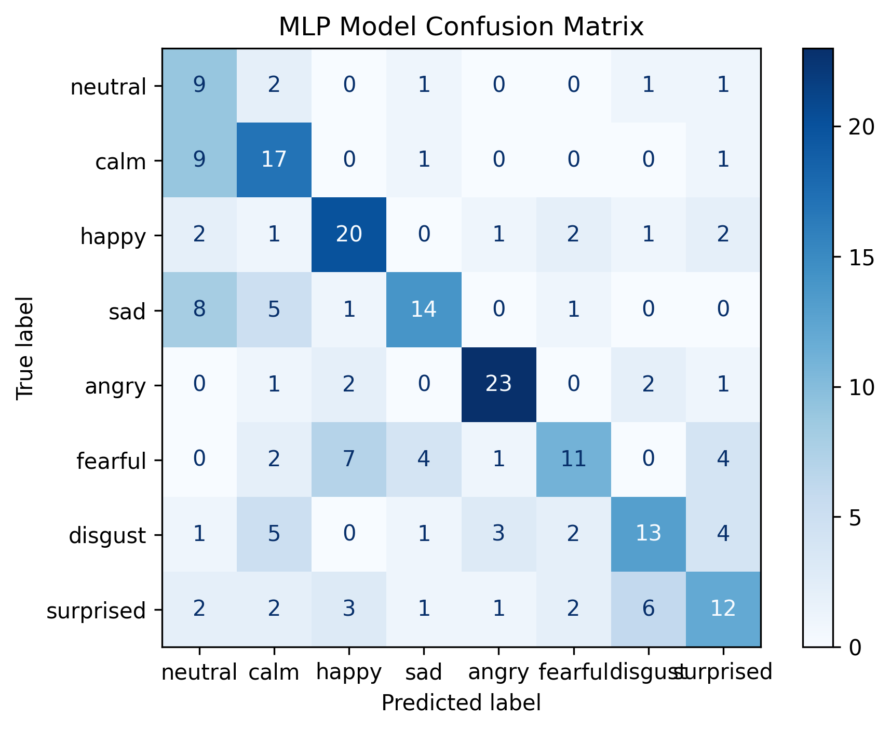
*Figure 9: Confusion matrices comparison between CNN and MLP models*

### Training Configuration

- **Optimizer**: Adam with learning rate scheduling
- **Loss Function**: Categorical Cross-Entropy with class weights
- **Batch Size**: 32
- **Early Stopping**: Patience of 15 epochs
- **Validation Split**: Stratified 20%
- **Data Augmentation**: None (real RAVDESS dataset)

### Additional Visualizations

#### Per-Class Metrics
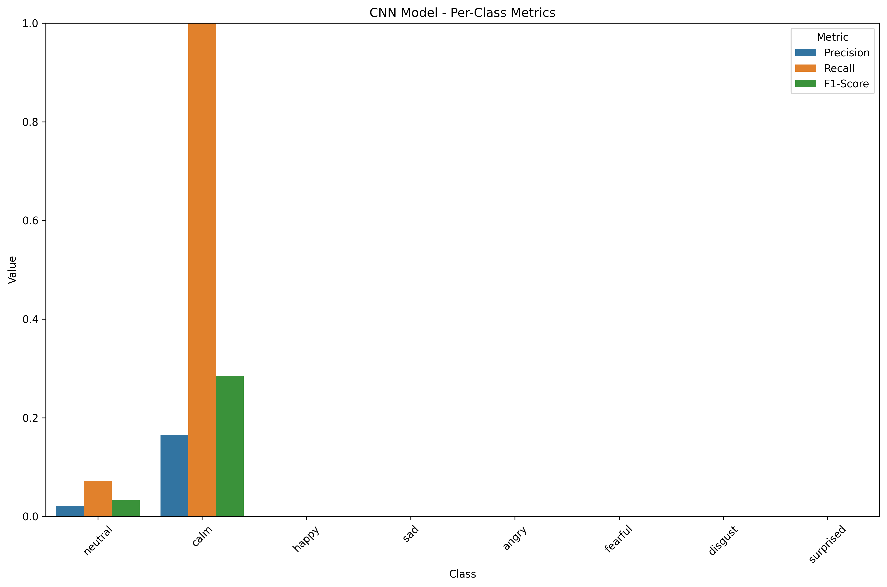
*Figure 10: Detailed per-class performance metrics for CNN model*

#### Model Evaluation Summary
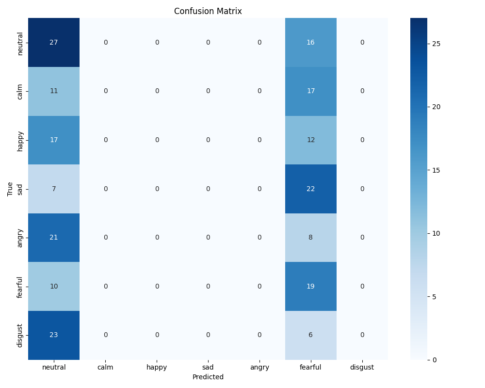
*Figure 11: Comprehensive model evaluation summary*

#### Training History Details
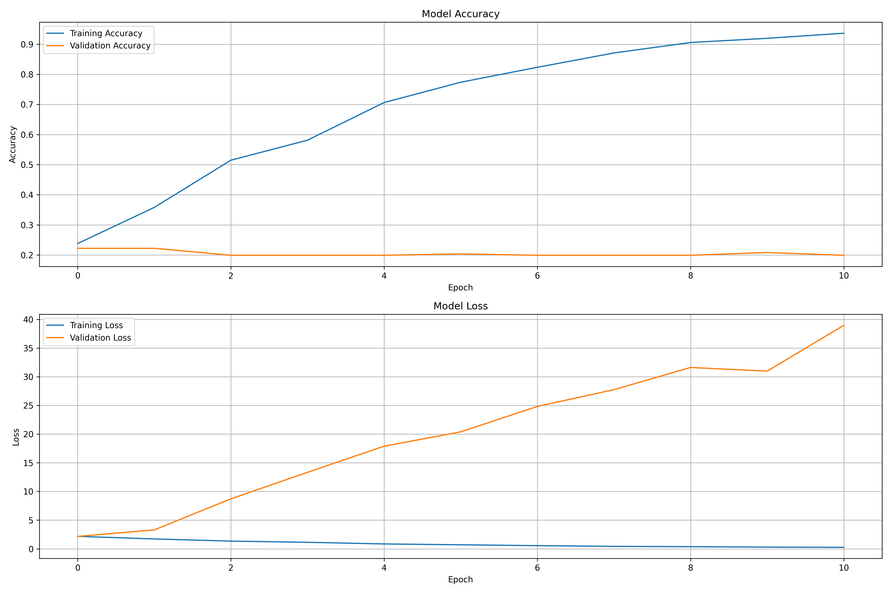
*Figure 12: Detailed training history with additional metrics*

### Interactive Visualizations

#### Training History Dashboard
Interactive training history: [View Interactive Chart](results/visualizations/training_history_interactive.html)

#### Misclassification Analysis
Interactive misclassification analysis: [View Detailed Report](results/visualizations/misclassification_types.html)

#### t-SNE Feature Exploration
Interactive feature space exploration: [View t-SNE Analysis](results/visualizations/tsne_visualization.html)

### Model Architecture Summary

**Multi-Modal Fusion Model Parameters:**
- **Total Parameters**: ~32.3M (CNN-based), ~10.8M trainable
- **Input Shapes**: MFCC (13,), Spectrogram (128, 165, 1)
- **Fusion Strategy**: Late fusion with concatenation
- **Regularization**: L2 (0.0001), Dropout (0.3), BatchNorm

Detailed model summary: [View Complete Architecture](results/visualizations/model_summary.txt)

## 🔧 Technical Details

### Dependencies

```txt
tensorflow>=2.12,<2.17
librosa>=0.9.0
numpy>=1.20.0
pandas>=1.3.0
scikit-learn>=1.0.0
streamlit>=1.32.0
matplotlib>=3.5.0
seaborn>=0.11.0
```

### CUDA Support

The system is optimized for CUDA acceleration:

```python
def setup_cuda():
    """Configure CUDA for optimal performance"""
    physical_devices = tf.config.list_physical_devices('GPU')
    if physical_devices:
        for device in physical_devices:
            tf.config.experimental.set_memory_growth(device, True)
        print(f"CUDA enabled with {len(physical_devices)} GPU(s)")
    else:
        print("CUDA not available, using CPU")
```

### Model Persistence

Models are saved in multiple formats:
- **Keras Format** (`.keras`): Full model with architecture and weights
- **H5 Format** (`.h5`): Legacy HDF5 format
- **Architecture JSON**: Model configuration for reconstruction
- **Feature Info JSON**: Feature extraction parameters and normalization

## 🎨 Visualization Features

### Training History
- Loss and accuracy curves for train/validation sets
- Real-time monitoring with TensorBoard integration
- Interactive training history: [View Interactive Chart](results/visualizations/training_history_interactive.html)

### Performance Analysis
- Confusion matrix with emotion-wise breakdown
- ROC curves for multi-class evaluation
- Per-class precision, recall, and F1-score metrics
- Prediction distribution histograms

### Feature Visualization
- MFCC coefficient plots
- Mel-spectrogram heatmaps
- t-SNE embeddings of feature space
- Sample analysis with feature extraction details

### Sample Analysis Examples

#### Sample 103 Analysis
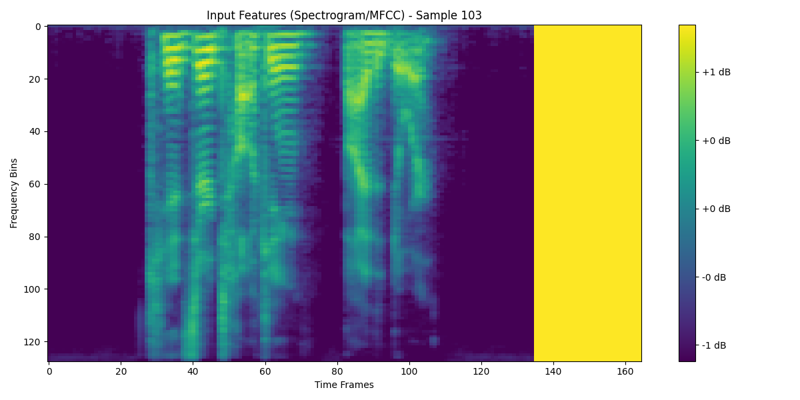
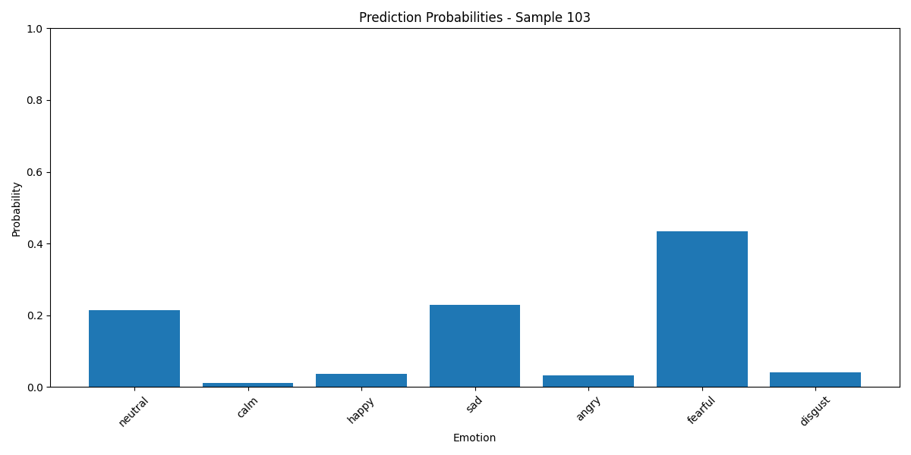
*Figure 5: Feature extraction and prediction analysis for sample 103*

#### Sample 149 Analysis
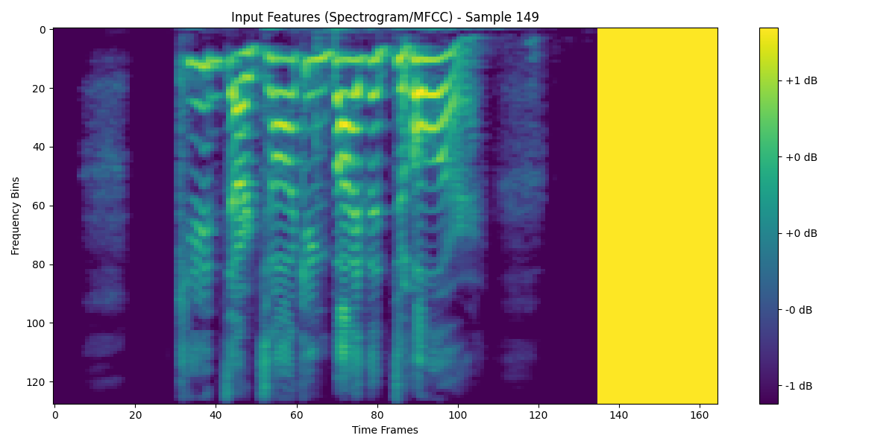
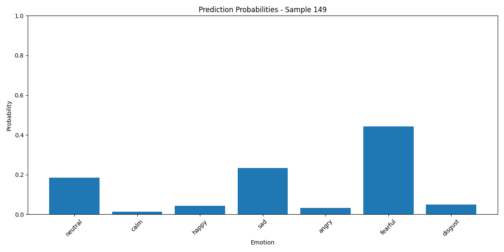
*Figure 6: Feature extraction and prediction analysis for sample 149*

### Misclassification Analysis
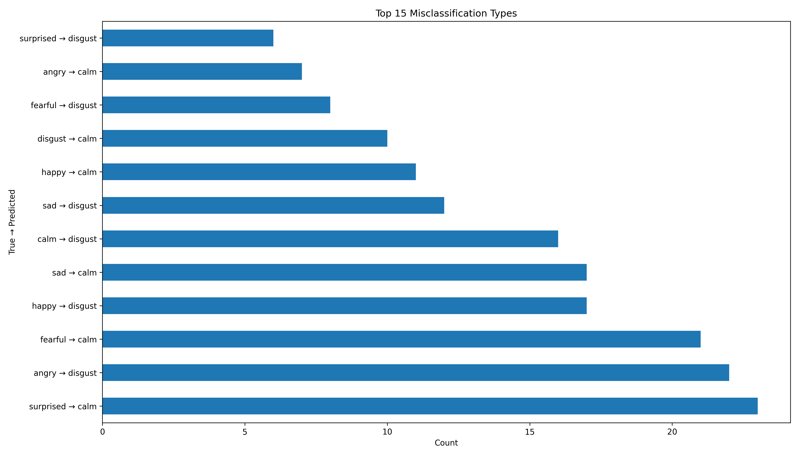
*Figure 7: Analysis of common misclassification patterns*

Interactive misclassification analysis: [View Detailed Report](results/visualizations/misclassification_types.html)

## 🧪 Testing & Validation

```bash
# Run unit tests
pytest tests/

# Run specific test modules
pytest tests/test_model_manager.py -v

# Run integration tests
pytest tests/test_app.py -v
```

## 📁 Project Structure

```
speech_emotion_classification/
├── app.py                          # Streamlit web interface
├── auto_train.py                   # Automated training script
├── setup.py                        # Package configuration
├── requirements.txt                # Python dependencies
├── Dockerfile                      # Container configuration
├── README.md                       # This file
├── src/
│   ├── __init__.py
│   ├── main.py                     # CLI entry point
│   ├── api/
│   │   └── server.py               # REST API server
│   ├── core/
│   │   ├── config.py               # Configuration management
│   ├── data/
│   │   └── data_loader.py          # Dataset loading & preprocessing
│   ├── features/
│   │   └── feature_extractor.py    # Audio feature extraction
│   ├── models/
│   │   ├── emotion_model.py        # Neural network architectures
│   │   ├── model_manager.py        # Model loading & saving
│   │   ├── trainer.py              # Training orchestration
│   │   └── optimizer.py            # Hyperparameter optimization
│   ├── ui/
│   │   ├── app.py                  # Main UI application
│   │   ├── dashboard.py            # Analytics dashboard
│   │   └── streamlit_app.py        # Streamlit wrapper
│   └── utils/
│       ├── tf_utils.py             # TensorFlow utilities
│       └── monkey_patch.py         # Compatibility fixes
├── models/                         # Saved model files
├── results/                        # Training results & visualizations
├── logs/                           # Training logs
├── tests/                          # Unit & integration tests
└── demo_files/                     # Sample audio files
```

## 🔬 Research & Development

### Key Innovations

1. **Multi-Modal Fusion**: Combines MFCC and mel-spectrogram features for richer representation
2. **Balanced Training**: Class-weighted loss to handle emotion imbalance
3. **Robust Feature Extraction**: Comprehensive audio preprocessing pipeline
4. **Real-time Inference**: Optimized for low-latency emotion detection

### Future Enhancements

- [ ] **Transformer Architecture**: Self-attention for temporal modeling
- [ ] **Multi-Task Learning**: Joint emotion and speaker recognition
- [ ] **Data Augmentation**: Synthetic emotion generation
- [ ] **Edge Deployment**: TensorFlow Lite for mobile devices
- [ ] **Multi-Language Support**: Cross-lingual emotion recognition

## 🤝 Contributing

1. Fork the repository
2. Create a feature branch (`git checkout -b feature/amazing-feature`)
3. Commit your changes (`git commit -m 'Add amazing feature'`)
4. Push to the branch (`git push origin feature/amazing-feature`)
5. Open a Pull Request

## 📄 License

This project is licensed under the MIT License - see the [LICENSE](LICENSE) file for details.

## 🙏 Acknowledgments

- **RAVDESS Dataset**: Ryerson Audio-Visual Database of Emotional Speech and Song
- **TensorFlow/Keras**: Deep learning framework
- **Librosa**: Audio processing library
- **Streamlit**: Web application framework

## 📞 Support

For questions, issues, or contributions:
- **GitHub Issues**: [Report bugs or request features](https://github.com/Rayyan9477/speech-emotion-classification/issues)
- **Email**: [Contact the maintainers](mailto:rayyanahmed265@yahoo.com)

---

**Built with ❤️ for emotion-aware AI applications**